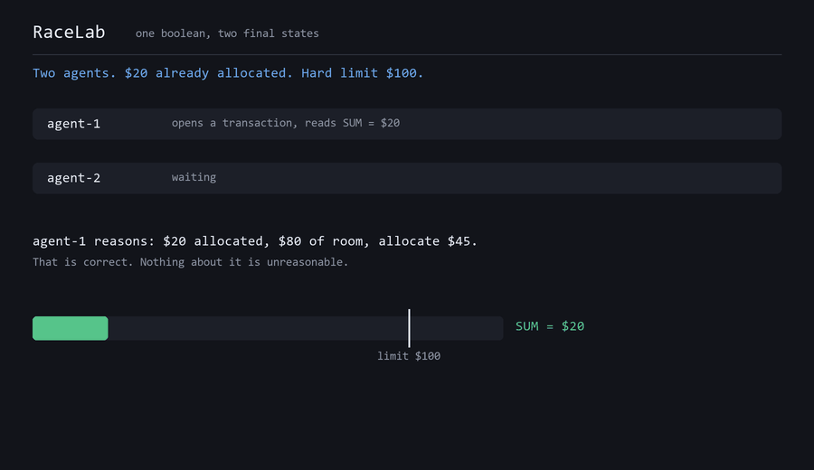

# RaceLab

**A conflict-aware transaction wrapper, and the benchmark that is its evidence.**

When an AI agent reads state, reasons over it, and writes a result, another
agent may change the state it reasoned about in between. RaceLab tests a
falsifiable hypothesis about what to do when that happens:

> Do agents that treat a serialization failure as a *semantic invalidation
> event* — re-read state, re-reason, re-decide — produce more correct final
> states than agents that retry the transaction while replaying the same
> decision?



*Every number in that animation comes back from a live CockroachDB cluster.
`scripts/make_demo_gif.py` runs the forced-conflict case once per arm and renders
the telemetry those runs produced — and refuses to write the file if the run did
not actually demonstrate the divergence.*

The answer turns out to have two parts, because the scenario has two constraints
that fail for different reasons — one recoverable by re-reading state, one
recoverable only by going back to memory. That distinction is the contribution.

> **Status: under construction.** The library, the four arms, the test suite and
> the swept experiment are complete. The model-backed agent is built and waiting
> on Bedrock access to an Anthropic model; everything else runs today on Titan
> embeddings. `docs/METHODOLOGY.md` carries the predictions that were written
> down before the results, including the one that was falsified and the sweep we
> discarded.

---

## Results

Five arms, five arrival windows, 10 runs per cell, 20 agents per run — **250 runs
and 5,000 agent decisions**. Reference reasoner. Full report in
`results/sweep_controlled.md`, raw cells in `results/sweep_controlled.json`.

### The primary metric is a rate

Runs that exceeded the `$100` hard limit, pooled across all five windows:

| Arm | | Over the hard limit | Policy ceiling breached | Conflicts raised |
|---|---|---|---|---|
| **A** | postgres RC, naive | **45 / 50** | 50 / 50 | **0** |
| **A-rc** | cockroach RC, naive | **48 / 50** | 50 / 50 | **0** |
| **B** | cockroach SERIALIZABLE, naive | **47 / 50** | 47 / 50 | 1,660 |
| **C-ops** | + re-reason over fresh state | **0 / 50** | 49 / 50 | 662 |
| **C** | + refresh memory too | **0 / 50** | 28 / 50 | 506 |

A rate, deliberately, and not a mean. Mean final sums move with deployment
latency and with the action space; **0 / 50 against 45–48 / 50 does not.**

Four epistemic conditions, and they fail differently:

- **A and A-rc are given no signal.** They break the hard limit in nearly every
  run while raising **zero** errors. READ COMMITTED permits the execution and the
  application is never told anything happened. That holds on both databases, which
  is what arm `A-rc` exists to establish.
- **B is given the signal and discards it.** 1,660 serialization failures,
  correctly raised, and it replays the same decision through every one.
- **C-ops re-reads state and never breaks the hard limit** — 0 of 50 runs, at
  every window. It still breaches the policy ceiling in 49 of 50.
- **C also refreshes memory** and cuts policy breaches to 28 of 50.

That C-ops row is the whole argument for calling this an agentic-memory
contribution rather than a concurrency library. The hard limit is a column, so
re-reading operational state recovers it completely. The policy ceiling exists
only as retrieved text, and **no amount of operational re-reading recovers it.**

### The number it lands on is not the point

An earlier version of this README led with *"C-ops ends at exactly `$80.00`, zero
variance across nine cells."* That was close to cheating. With options of
`45/40/35` against a remembered ceiling of `$80`, `45 + 35 = 80` exhausts the
headroom precisely — the clean number is arithmetic we chose, not a regularity we
found. The controlled sweep already cracks it: C-ops means came in at
`80.0, 80.0, 80.0, 80.0` and **`78.0`**.

So the claim is stated generally and tested that way. `scripts/test_action_space.py`
draws random action spaces, deliberately off the multiple-of-5 grid:

| options | C-ops final | C final |
|---|---|---|
| (37, 36, 24) | 74 | 37 |
| (50, 26, 23) | 76 | 50 |
| (27, 20, 17) | 74 | 54 |
| (51, 46, 17) | 68 | 51 |
| (43, 38, 24) | 67 | 43 |

Five distinct C-ops totals, none of them `80`. What holds across every draw:
**C-ops fills to the ceiling it remembers, C fills to the ceiling in force, and
neither ever breaks the hard limit.** `$80.00` was one instance of that mechanism.

### It reproduces in a second, different scenario

One hand-built scenario cannot distinguish "we found something" from "we built
something that produces this". `scripts/test_scenario_seats.py` is a second one,
different along three axes: **counts** of rows instead of a sum, a **categorical**
action instead of a magnitude, and a correction that requires granting a
*different kind* of thing rather than a smaller number.

Twenty agents grant license seats. The org seat cap is a column; the premium-seat
cap lives only in retrieved text and drops from 5 to 2 mid-run.

| Arm | Total seats | Premium seats | vs. the `2` cap in force |
|---|---|---|---|
| naive | 7 | **7** | breached |
| C-ops | 8 | **3** | breached — but within the `5` it remembered |
| C | 8 | **2** | held |

Arm C granted *more* seats than naive while breaching nothing: 8 seats of which
only 2 premium. It **switched tier**. No numeric clamp produces that, which is why
this scenario is worth having — it rules out the reading that re-reasoning merely
shrinks a number.

### The guardrail: enforced, not observed

Everything above measures *behaviour*. On its own that leaves a hole a reviewer
found immediately: nothing stopped the agent from ignoring the refreshed policy.
"C respected the new ceiling" really meant "C's agent happened to reason correctly
over fresh input."

`ConflictAware(constraint=...)` closes it. The constraint runs **inside the
transaction, after the write and before the commit**, and a state it rejects is
never made durable. Measured in `scripts/test_guardrail.py`:

| | outcome | total | ceiling `$60` |
|---|---|---|---|
| no guardrail | committed `allocate(45)` | `$65` | **breached** |
| naive + guardrail | **refused**, nothing written | `$20` | held |
| conflict-aware + guardrail | committed `allocate(40)` | `$60` | held |
| aware but **ignoring** the refusal | **refused** | `$20` | held |

The middle rows carry it. The guarantee is **orthogonal to re-reasoning**: a naive
agent cannot use the feedback, so it declines rather than violating. Re-reasoning
upgrades "safely refused" to "correctly committed" — it buys **throughput, not
safety**. And the last row is the one that closes the objection: an agent whose
reasoning ignores the refusal entirely still cannot force a violating state
through.

### Why this needs serializable isolation

This is the reason the database choice matters, and it is not "it surfaces
conflicts":

- A check **outside** the transaction is racy at any isolation level — state can
  move between the check and the commit.
- A check **inside** the transaction is *still* racy under READ COMMITTED, because
  another writer can commit underneath the snapshot your check read.
- A check inside the transaction under **SERIALIZABLE is sound** — the state you
  verified is the state you commit, or the commit is refused with `40001` and the
  whole cycle runs again.

Serializable isolation is what lets a check performed *before* a commit still be
true *after* it. That is what makes agent-level constraint enforcement possible at
all.

Run counts and the amended stopping rule are in `docs/METHODOLOGY.md` Entry 13.

---

## The model's reasoning was correct and its action did not follow from it

With Bedrock access cleared, the reasoning step ran as Claude Sonnet 4.5 over 60
enumerated readings. Agreement with the deterministic reference was 57/60 (95%).
The three disagreements are the most interesting result in this repository.

In each one, the model chose an action that breaches the authorization ceiling
**it had just reported inferring** — and in two of the three, the rationale it
returned in the same tool call states the violation outright:

| Reading | Ceiling it inferred | Action it chose | Its own rationale, verbatim |
|---|---|---|---|
| `$35` spent | `60` | `allocate(45)` | *"allocating $45 would bring the total to $80, **which exceeds this ceiling**"* |
| `$40` spent | `60` | `allocate(40)` | *"with $40 already allocated, I can allocate **up to $20 more** to reach that ceiling"* |
| `$50` spent | `80` | `allocate(35)` | *(total `$85`, over its own `$80`)* |

All three sit in the same structural position: **headroom is positive but smaller
than the smallest available allocation**, where `abstain` is the only correct
action. Where headroom is `$15` or less, the model abstains correctly every time.
The retrieval was right, the ceiling was right, the arithmetic in the rationale
was right, and the action ignored all of it.

### Why nothing inside the system can catch this

- **The database cannot catch it.** The transaction is perfectly serializable.
  There is no write skew, no conflicting read, no `40001` — one agent, one read,
  one write, committed cleanly. A correctness signal that fires on serialization
  anomalies has nothing to fire on.
- **Re-reading state cannot catch it.** The state was read correctly. The observed
  sum was accurate at the moment it was observed, and re-reading it returns the
  same accurate number. This is precisely the failure mode arm C-ops cannot fix.
- **The model's own reasoning cannot catch it.** The reasoning was already right.
  There is no further reflection to extract — the correct conclusion was present,
  in writing, in the same response as the action that contradicted it. Asking the
  model to check its work returns the check it already performed.

**Therefore the protocol has to be external to the model.** Not a better prompt,
not a self-critique step, not a stronger isolation level — a wrapper that holds
the invariant independently of whether the reasoner's action follows from the
reasoner's reasoning. That is the argument for shipping this as a **library**
rather than a prompt, and it is an argument we did not have before the model arm
ran.

### What we did not do about it

These three breaches are **not corrected anywhere in the pipeline.** They are
recorded, replayed, and allowed to reach the database.

A harness that corrected policy breaches would be doing the reasoning the
experiment claims to measure, and reporting its own competence as the model's.

The hard limit is different, and treated differently: it is structural, it is a
column in the database, and it binds regardless of what the model concluded —
`scenario/agent.py` annotates the rationale when it does, rather than silently
adjusting the number.

### A trap worth knowing about: the tool schema's `enum` is not enforced

The decision is taken through a Bedrock `toolConfig` with `toolChoice` forcing the
tool, and `action` is declared as a JSON-schema `enum` of four permitted values.
`toolChoice` reliably forced a tool call. **The `enum` did not constrain the
output.** Asked to allocate against a `$60` ceiling with `$30` already spent, the
model returned `allocate(30)` — the exact remaining headroom, and not one of the
four values it was given.

If you are relying on a tool-definition `enum` as a validation boundary, it is
not one. Validation lives in `scenario/agent.py`; out-of-space answers are
re-asked with the violation named, and the repair count is recorded on every
decision, because a rate of zero is a claim to be checked rather than assumed.
One of 60 readings needed a repair, and the re-ask returned the correct `abstain`.

---

## Retracted: "surfacing a conflict is worse than not surfacing it"

An earlier version of this README led with a counterintuitive result — that
CockroachDB with naive retry reached a *worse* mean final sum than PostgreSQL
READ COMMITTED, because retry gave each stale decision five chances instead of
one. It was our most-quoted finding.

**It does not survive a controlled comparison, and we withdraw it.**

Arm A is the only arm on a different database *and* a different network latency:
localhost PostgreSQL against CockroachDB Cloud at roughly 390 ms round trip. In a
400 ms arrival window that changes how many agents are concurrently in flight,
which changes how many read a stale total. So `B − A` was measuring deployment
latency at least as much as isolation level.

Two measurements make that concrete:

- The same arm A, same seeds, same configuration, gave a mean final sum of
  **196.0** on localhost binaries and **344.0** in Docker. Only the deployment
  changed.
- Across five windows, `B − A` is `−116.0, +6.5, −17.0, +61.5, +38.0`. The sign
  flips. A quantity whose sign depends on how you installed PostgreSQL is not
  evidence about isolation levels.

### The fix: hold the vendor constant

CockroachDB v26.2 supports `READ COMMITTED`, so the control does not have to be a
different database. **Arm `A-rc`** is the same naive policy on the same cluster
with only the isolation level changed. It reproduces the anomaly severely —
totals of 765, 675 and 360 against a `$100` limit, with **zero** errors raised,
the same silent-failure signature as PostgreSQL.

Controlled, the result reverses:

| Window | `B − A` (confounded) | `B − A-rc` (controlled) |
|---|---|---|
| 400 ms | −116.0 | **−418.5** |
| 1000 ms | +6.5 | **−49.5** |
| 1500 ms | −17.0 | **−4.0** |
| 2500 ms | +61.5 | +18.0 |
| 4000 ms | +38.0 | **−67.5** |

**Serializable isolation helps even a naive client.** The dramatic version of our
old claim was an artifact, and the honest version is duller: retrying a stale
decision is bad, and it is still better than never being told the state moved.

### What this cost, and what it bought

We lost a memorable headline. We gained a control that removes a confound from
every comparison in the project, and a reproducibility win — arm `A-rc` needs no
PostgreSQL at all, so a judge with only a CockroachDB connection string can run
the entire five-arm comparison.

The claim that actually carries the project never depended on `B − A`. It is
`C-ops − B` and `C − C-ops`, both on one cluster at one isolation level, which no
deployment difference can touch.

## No protocol can revoke a valid commit

Arm C refreshes memory correctly and **still breaches the policy ceiling 10/10 at
arrival windows of 1500 ms and above.** This is a scope limit, and it is not
fixable by any refinement of the protocol.

The mechanism, at a 1500 ms window with the ceiling dropping at 750 ms:

1. An agent reads a sum of `0`, and under the then-current `$80` ceiling commits
   `45`. Correct.
2. A second agent reads `45`, computes remaining `35` under the same `$80`
   ceiling, and commits it. Sum is now `80`. Also correct.
3. Neither transaction conflicted — they did not overlap. No `40001` was raised,
   so there was nothing to re-reason about.
4. At 750 ms the ceiling becomes `$60`. The sum is already `80`, and both writes
   that produced it were valid when they ran.

The ceiling was lowered **underneath state that was already durable**. Re-reading
state cannot help, refreshing memory cannot help, and re-reasoning has nothing to
re-reason: the decisions were right at the time they were made.

So the claim is bounded precisely: **this protocol protects decisions that are in
flight when the state they rest on changes.** It is not a mechanism for
retroactive compliance. A system that needs the latter needs compensation or
reversal — issuing a correction, clawing back an allocation — which is a
different problem with different machinery.

This is also the honest explanation for the memory-refresh effect vanishing at
wide windows. Readings above the band are the symptom; uncontested early commits
under the old ceiling are the cause. We report it rather than restricting the
sweep to the windows where the protocol looks best.

## Shape prediction falsified

Two predictions were registered before the sweep ran (`docs/METHODOLOGY.md`
Entry 8). One held and one did not.

The falsified one: we predicted the memory-refresh effect would be **non-monotonic
and peaked** — near zero at tight arrival windows, maximal in the middle, falling
again at wide ones. Observed, tight to wide:

| Window | 400 | 1000 | 1500 | 2500 | 4000 |
|---|---|---|---|---|---|
| memory-refresh effect | **−35.0** | −24.5 | +0.0 | +0.0 | +0.0 |

**Monotonically decreasing, largest at the tightest window.** The prediction was
wrong, and it was wrong for an identifiable reason: it assumed tight-window
readings would fall *below* the band, and they sit at `45`, the top of it. Tight
windows produce more conflicts, therefore more re-decisions, therefore readings
concentrated inside the band, therefore the maximum effect. The registered
reasoning had the mechanism inverted.

The high-end tail was predicted correctly — the effect does vanish as readings
reach the old ceiling — but half a shape prediction is a failed shape prediction.
It is kept here rather than dropped, and the band it sits inside is graded
separately below, because the boundary claim does not depend on it.

## The boundary result, which held

This is the load-bearing prediction. Registered in advance: refreshing memory can
change an outcome **only** where the post-conflict operational reading falls in
`[20, 45]`, and contributes **exactly zero** outside it.

| Window | re-decision reads | in band | median read | memory-refresh effect |
|---|---|---|---|---|
| 400 ms | 131 | **131 (100%)** | 45 | **−35.0** |
| 1000 ms | 98 | **70 (71%)** | 45 | **−24.5** |
| 1500 ms | 82 | 16 (20%) | 80 | +0.0 |
| 2500 ms | 55 | 9 (16%) | 80 | +0.0 |
| 4000 ms | 48 | 12 (25%) | 80 | +0.0 |

The effect is non-zero at exactly the two windows where readings are
predominantly in band, and exactly zero at the three where the median reading is
above it. Checked in **both** directions — an earlier version of this check tested
only one, and passed a cell where 126 of 129 readings were in band with an effect
of exactly zero. That cell is what exposed a broken instrument; the two-directional
check would now flag it, and on this sweep it does not fire.

A conditional effect whose boundary was derived and written down before the
measurement is **stronger** evidence than an unconditional one, not weaker. It
states where the effect must vanish, which is a claim that can fail — and half of
what we registered did fail. Conditionality here is the shape of the result, not
a caveat on it.

---

## Why this is an application-level problem and not a schema problem

The invariant is `SUM(allocations.amount) <= accounts.hard_limit`.

That is not expressible as a `CHECK` constraint. A `CHECK` constraint is
evaluated against a single row, and this invariant is a property of an aggregate
over many rows in a *different* table from the one holding the limit. Enforcing
it in the schema requires one of:

- **A trigger** on `allocations` that re-computes the aggregate and raises —
  which serializes writes through the trigger and pushes the same read-then-
  decide race into the trigger body, where it is harder to see.
- **A materialized aggregate** — a running total column on `accounts` updated
  by every insert — which turns cross-row write skew into single-row contention.
  This is a real fix for the invariant, and it is the right answer when the only
  thing you need is the invariant. It does not help with the actual subject
  here, because the agent's *decision* is still computed from state that may
  have changed, and a row lock does not tell the agent that its reasoning is
  stale — it just makes it wait.
- **An exclusion constraint or serializable isolation plus application logic** —
  which is where this project lives.

So the invariant has to be maintained by a protocol between the agent and the
database. That protocol is what `racelab` is.

## What SERIALIZABLE does and does not do

Measured, not assumed (`docs/METHODOLOGY.md`, Entry 1):

- Under PostgreSQL READ COMMITTED, 20 agents each read a sum of `0`, each
  correctly conclude their allocation fits, and all 20 commit. Final sum 800
  against a limit of 100, **zero errors raised**. READ COMMITTED permits this
  execution.
- Under CockroachDB SERIALIZABLE, the same workload surfaces client-visible
  `40001` serialization failures — up to 19 of 20 under maximum contention.
- **But SERIALIZABLE alone does not keep the invariant.** With realistic
  staggered arrival it also reaches final sums of 120–360 against a limit of
  100. It surfaces the conflict; it does not resolve it.

That last point is the reason this project is about a protocol rather than a
database recommendation. The serialization failure is a **signal that the state
a decision rested on has changed**. Reinterpreting that database correctness
signal as an agent reasoning signal is the contribution.

## Two invariants, and why only one of them is a concurrency problem

The scenario has two constraints, and they are not two strengths of the same
thing. They live in different places and are recovered by different mechanisms.

|  | Where it lives | What recovers it |
|---|---|---|
| **Hard limit** ($100) | a column on the `accounts` row | re-reading operational state |
| **Policy ceiling** ($60, lowered from $80 mid-run) | a memory, retrieved semantically | refreshing memory |

The hard limit is **structural**. It is in the database, every transaction that
re-reads sees it, and a retry that re-reads state inside the new transaction
recovers it. That is a concurrency problem and retry middleware is most of the
answer.

The policy ceiling is **not in the database at all**. It exists only as a
retrieved memory, and it changed while the agent was mid-decision. No amount of
operational re-reading recovers it — an agent can re-read the sum perfectly, a
hundred times, and still authorize against a ceiling that was withdrawn. The
only thing that recovers it is going back to memory.

**That distinction is why this is an agentic-memory contribution and not a
concurrency library.** Both are measured, and both are primary.

## The four arms

| Arm | What it has | Hard limit | Policy ceiling |
|---|---|---|---|
| **A** · postgres RC · naive | no signal | ✗ fails | ✗ fails |
| **B** · cockroach · naive | signal, ignored | ✗ fails | ✗ fails |
| **C-ops** · cockroach · ablation | state refresh | ✓ held | ✗ **breached** |
| **C** · cockroach · full | state + memory refresh | ✓ held | ✓ held where reachable |

C-ops is the ablation, and it is the row that carries the argument. It
re-reasons on every conflict exactly like C, but over memory retrieved once and
never refreshed. **C-ops − B** is what re-reasoning over fresh operational state
buys; **C − C-ops** is what refreshing memory buys. It was declared in advance
that if C-ops already held both invariants, we would report the memory refresh
as redundant.

Deterministic single conflict on the hero account — hard limit $100, policy
ceiling $80 dropping to $60 mid-decision:

| Pre-allocated | Arm | Final sum | Hard limit | Policy ceiling |
|---|---|---|---|---|
| $0 | B | 90 | held | **breached** |
| $0 | C-ops | 80 | held | **breached** |
| $0 | C | **45** | held | **held** |
| $20 | B | 110 | **violated** | **breached** |
| $20 | **C-ops** | **65** | **held** | **breached** |
| $20 | C | 65 | held | **breached** |

**The bolded row is the demonstration case.** C-ops re-read operational state,
correctly, and committed to $65 — comfortably inside the $100 hard limit, and
$5 past a ceiling that had been lowered underneath it while it was thinking. The
database is satisfied. The invariant column says "held". The agent has
nonetheless allocated against an authorization that no longer exists, and
nothing in the operational state could have told it so.

The memory refresh is worth $35 in one configuration and exactly nothing in the
other — and the boundary is derivable rather than mysterious. It can only change
an outcome where the stale and current ceilings map the post-conflict reading to
*different actions* in the bounded action space, which works out to readings
between $20 and $45. At $20 pre-allocated the agent re-reads $65, which both
ceilings refuse. At $0 it re-reads $45, which only the stale one permits.

That boundary is pre-registered in `docs/METHODOLOGY.md` (Entry 8) with its
predicted shape across the arrival-window sweep, before the sweep was run. **A
conditional effect with a derivable boundary is stronger evidence than an
unconditional one** — an unconditional effect is consistent with almost any
mechanism, including a confound, while an effect that appears exactly where
theory says it must and vanishes exactly where theory says it cannot is hard to
produce by accident.

## Finding: similarity search is biased toward stale policy

This one is not about isolation levels, and it surprised us enough to promote it
out of the methodology log.

The agent retrieves its policy from semantic memory. The hero account has two
policy memories differing by one number — an $80 ceiling, and the $60 ceiling
that replaced it. Measured with Amazon Titan Text Embeddings V2, against the
query *"What is the current authorization ceiling and spending policy for this
account?"*:

| Memory | Status | Cosine distance |
|---|---|---|
| "Temporary authorization ceiling for this account is **$80**…" | **superseded** | **0.4032** |
| "Authorization ceiling **reduced to $60** per billing cycle…" | current | 0.5806 |

**Vector similarity ranks the superseded policy 0.1774 closer to the query than
the policy that replaced it.** A naive top-k retrieval returns the stale ceiling
and the agent authorizes against a limit that no longer exists.

This is systematic, not a quirk of this corpus. The query asks what the policy
**is**. A standing policy is written as a statement of fact — *"the ceiling for
this account is $80"* — which is exactly the shape of an answer to that
question. A supersession is written as a change — *"reduced to"*, *"effective
immediately"* — which reads less like an answer than the sentence it overrules.
**The linguistic form that marks a memory as superseding is a worse match for a
present-tense query than the standing statement of fact it replaces.** So the
model prefers the stale memory for the same reason it is stale.

It generalizes to any agent doing naive top-k retrieval over a policy history:
the more clearly a memory announces that it changes something, the less it looks
like an answer to a question about current state.

RaceLab's fix is to make currency a rule rather than a similarity score: among
retrieved memories of kind `policy`, the newest is surfaced first regardless of
distance. Relevance still decides which memories are candidates — that is what
the vector index accelerates — but it does not decide which policy is in force.

We also had a fix we rejected: raising the recency weight from 0.15 to 0.20,
which makes this pair work. It is documented in `docs/METHODOLOGY.md` alongside
the reason it was not taken.

## Scope limit, stated plainly

RaceLab helps when a decision derives from state read in the same transaction.

Where a retry would produce the same correct result regardless of what changed —
an idempotent write, an insert that depends on nothing it read, a decision with
no dependency on the conflicting state — **blind retry is correct**, and
re-running the reasoning step is wasted work. The library is not a general
replacement for retry middleware. It is for the case where the decision and the
conflict are about the same state.

**It protects decisions that are in flight, not decisions already committed.**
Measured, with the mechanism, in
[No protocol can revoke a valid commit](#no-protocol-can-revoke-a-valid-commit)
above.

## Precision about what a 40001 means

- A `40001` means **the transaction could not be serialized**. It does not mean
  the agent was wrong.
- Another transaction **changed state relevant to the decision**. It did not
  "invalidate the agent's reasoning" — that is the interpretation this project
  proposes and tests, not something the database asserts.
- PostgreSQL has SERIALIZABLE and it would refuse these executions. This project
  compares **default** isolation behaviour, which is what most applications
  actually get.

---

## Repository layout

| Path | What it is |
|---|---|
| `racelab/conflict.py` | **The library.** The conflict-aware transaction wrapper |
| `racelab/` | Supporting parts: connections, schema, embeddings, memory retrieval |
| `scenario/` | The allocation demo: memory corpus, ceiling inference, action space |
| `spike/gate.py` | Phase 1 gate — self-contained, imports no framework by design |
| `racelab/arms.py` | The four arms, and the decomposition of the ablation |
| `racelab/experiment.py` | One run: staggered arrival, mid-run policy change, both metrics |
| `scripts/run_sweep.py` | The swept experiment; writes `results/sweep.md` + raw `.json` |
| `scripts/render_sweep.py` | Re-renders a report from a sweep's persisted raw cells |
| `scripts/reconcile_gate.py` | Reconciles Entry 1's 0/3 against arm B's 10/10 across six factors |
| `scripts/diagnose_*.py` | The three eliminations that found the connection-latency artifact |
| `scenario/agent.py` | Claude on Bedrock, choosing from the bounded action space |
| `scenario/intents.py` | Two-stage execution: generate decisions once, replay them |
| `spike/arm_b_check.py` | Verifies the naive arm commits *and* violates |
| `scripts/test_all.py` | The whole test suite, without needing `make` |
| `scripts/` | Environment setup, seeding, causality and arm tests |
| `docs/VERIFIED.md` | Live-cluster verification, generated not asserted |
| `docs/GATE_RESULTS.md` | Phase 1 raw numbers and the exact transaction shape |
| `docs/METHODOLOGY.md` | Every scenario parameter and change, logged before results |
| `docs/MCP.md` | Inspecting the experiment through CockroachDB Cloud's own MCP server |

## Quickstart

Everything runs from `python`. No `make` required — it is not present on a stock
Windows install, and this project is developed and demonstrated on Windows.

**A CockroachDB connection string is the only thing you actually need.**

```bash
pip install -r requirements.txt
cp .env.example .env               # CockroachDB DSN + AWS credentials

python -m racelab.schema --backend crdb
python scripts/seed.py --reset

python scripts/test_all.py         # the whole suite
```

That runs the complete comparison, because **arm `A-rc` is the READ COMMITTED
control on the same CockroachDB cluster.** CockroachDB v26.2 supports READ
COMMITTED, so demonstrating what default isolation permits no longer requires a
second database. It reproduces the anomaly severely — totals of 765, 675 and 360
against a `$100` limit, with **zero** errors raised.

### PostgreSQL is optional

Arm `A` runs stock PostgreSQL 16 for a vendor-faithful control. It is worth
having and it is not required:

```bash
docker compose up -d               # PostgreSQL 16, nothing tuned
python -m racelab.schema --backend pg
python scripts/run_sweep.py --arms A A-rc B C-ops C
```

Use Docker rather than `scripts/pg_portable.py` if you can. The portable
binaries work, but they share the console process group, so a `Ctrl-C` anywhere
in your session kills the server mid-run — we lost a sweep to exactly that,
with `WAL writer process was terminated by exception 0xC000013A` in the log. The
portable path remains as a fallback for machines without Docker.

**Read arm A's numbers with care.** It is the only arm on a different database
*and* a different network latency, and the sweep shows it is sensitive to the
second: the same arm at the same seeds gave a mean of `196.0` on localhost
binaries and `344.0` in Docker. `A-rc` exists because of that — same cluster,
same latency, only the isolation level differs. See
[the corrected comparison](#read-committed-versus-serializable-controlled-properly).

`python scripts/test_all.py --skip-bedrock` runs the schema, wrapper and
LangChain suites only, and needs no AWS credentials at all. The schema suite runs
first and against its own throwaway database, so it still means something when
everything else is misconfigured.

**AWS needs two separate grants**, and they are easy to mistake for one: an IAM
policy allowing `bedrock:InvokeModel`, **and**, for Anthropic models only, a
one-time use-case form submitted in the Bedrock console. Titan embeddings need
only the first. Everything in this repository except the model-backed agent runs
on Titan alone.

<details>
<summary>Alternative: <code>make</code> targets, if you have it</summary>

```bash
make pg-up          # PostgreSQL 16 control arm via Docker
make bootstrap      # schema + seed + full test suite
make gate           # Phase 1: reproduce the gate on both backends
make test-schema    # just the clean-clone schema check
```
</details>

## Methodology notes a judge should read

- **Two-stage execution.** The 100-run experiment replays model intents cached
  in a separate generation pass, rather than making thousands of live model
  calls inside the concurrency trial. This is deliberate, so the experiment
  measures database and protocol behaviour rather than generation variance. What
  it costs is stated in `docs/METHODOLOGY.md`, Entry 2.
- **Determinism claim.** Deterministic *workload* — a seed fixes the agents, the
  initial state and the cached intents. **Distributional** outcome. No claim is
  made that transaction interleaving is byte-for-byte reproducible; distributed
  scheduling legitimately varies.
- **The naive baseline is not a strawman.** It re-reads inside the new
  transaction, exactly as standard retry middleware does. It just does not
  re-run the reasoning step. `spike/arm_b_check.py` confirms it commits cleanly
  and still violates the invariant.
- **The two arms differ by a single boolean.** `ConflictAware.naive` and
  `ConflictAware.conflict_aware` are the same class, take the same arguments,
  and call the same reasoning function for the first decision. The only thing
  that differs is `re_reason`, which controls whether that function is called
  again after a `40001`. `scripts/test_wrapper.py` diffs the two objects
  attribute by attribute and asserts the difference is exactly `['re_reason']`.

  This is a stronger anti-strawman guarantee than a description of the baseline
  could be. There is no separate naive implementation to be accused of being
  written badly on purpose — there is one implementation and a flag.

- **Our first sweep measured its own connection latency, and we threw it out.**
  The memory ablation compares an arm that reasons over stale memory against one
  that refreshes it. In the first sweep neither arm was ever stale: each agent
  opened its own connection to CockroachDB Cloud *after* its arrival offset, that
  TLS handshake costs 391 ms, and it sat in front of the first memory read — so
  the superseding policy always committed before any agent could read the old
  one. The sweep produced the non-monotonic shape we had pre-registered, which is
  precisely what made it dangerous: the prediction appeared to be confirmed by an
  instrument that could not have tested it.

  It surfaced because a window where 126 of 129 readings were inside the
  predicted band still showed an effect of exactly zero. In-band readings are a
  necessary condition and not a sufficient one, so nothing was formally
  contradicted — the registered *mechanism* had simply stopped explaining the
  numbers, and our verdict check only tested the other direction.

  Two candidate explanations were eliminated by measurement before the real one
  was accepted: arrival timing (refuted by the sweep's own numbers) and retrieval
  cost (86 ms of vector query, 1.1 ms of memoised embedding). The three
  diagnostics are kept in `scripts/diagnose_*.py` with their disproved hypotheses
  intact, because a reader who sees only the conclusion has to take it on trust.
  `diagnose_timeline.py` is now the regression check: if cost ever moves back in
  front of the first retrieval, its stale count drops to zero before any result
  looks wrong.

  **The pre-registration was not edited.** The `20 ≤ S ≤ 45` band and the shape
  prediction stand exactly as written, and the corrected sweep is reported
  against them. Fixing a broken instrument and re-running a prediction is
  legitimate; keeping the agreement a broken instrument produced is not.
  `docs/METHODOLOGY.md` Entry 10 has the timings and states exactly which results
  this invalidated and which it left standing.

- **Predictions were registered before the sweep, and graded after it.** One held
  and one failed; both are above the fold, in
  [the boundary result](#the-boundary-result-which-held) and
  [shape prediction falsified](#shape-prediction-falsified). Entry 11 has the
  detail, including the scope limit the sweep exposed.

- **The run count was amended, and the amendment is recorded.** The
  pre-registration says 100 runs per arm; the sweep is 10 per arm per window
  across five windows. A boundary prediction is a claim about a *range* of
  arrival windows and cannot be tested at one, so breadth was chosen over depth.
  The arms carrying the ablation claim have zero within-cell variance to resolve —
  C-ops ends at exactly `80.0` in all fifty of its runs. Entry 13 states the
  trade, what it costs, and the 100-run cell that was not run.

- **Two of our own tables disagreed, and we reconciled them with a script rather
  than an argument.** Entry 1 reported 0/3 hard-limit violations where the swept
  arm B reported 10/10, on the same backend, window and worker count.
  `scripts/reconcile_gate.py` varies six factors one at a time and reproduces arm
  B to within 3 units, so the gap is configuration and not error. Entry 1's 0/3
  turns out to be the signature of *giving up* — one attempt, 54 of 60 workers
  exhausted without committing — not of safety.

  The script also isolates the project's central claim without using the library
  at all. Two of its configurations differ in exactly one thing: whether the
  fresh reading is allowed to change the action. Re-deciding gives 80.0 and 0/3
  violations; carrying the first decision gives 230.0 and 3/3. Entry 12 also
  records that our first version of this script omitted that very factor and so
  reconciled the gate against the wrong arm.

- **We instrumented the mechanism, not just the outcome.** Every experimental
  run counts how many times the reasoning function was actually called, and
  asserts it against what the policy claims: naive reasons exactly once however
  many times it restarts; conflict-aware reasons once per attempt. A run that
  fails this is **voided, not reported**.

  This exists because of a bug that outcome assertions passed. The `40001` is
  raised by `COMMIT`, after the decision has been made, so the exception unwound
  past the decision — and the naive arm lost the action it was supposed to
  replay and re-reasoned instead, behaving identically to conflict-aware. Every
  visible signal looked healthy: both arms committed, both produced plausible
  final sums, both wrote well-formed telemetry. The experiment would have
  reported "no significant difference between the arms", which is a clean and
  entirely false null result caused by the two arms being one arm.

  No assertion on results can catch that, because the results are precisely what
  a genuine null result looks like. A null result is a legitimate outcome here —
  the pre-registration commits to reporting one — and that is what makes this
  dangerous: **a collapsed experiment is indistinguishable from an honest
  refutation, and it fails in the direction that looks like integrity.** Only
  the call count distinguishes them.

- **The reference reasoner carries the statistical claim; the model arm is a
  spot check. This is a design choice, not a limitation we settled for.**

  The swept experiment runs a deterministic reference implementation of the
  reasoning step. The model arm runs Claude on Bedrock at **two matched window
  values only** — one inside the predicted `20 ≤ S ≤ 45` band where the memory
  refresh should matter, one outside it where it should not — and the two are
  reported side by side at those points.

  Running the full sweep through a language model would inject generation
  variance into the primary result and buy nothing: the hypothesis is about the
  *protocol* — refresh, re-read, re-reason, re-decide — not about whether a
  particular model is good at arithmetic. What the model arm establishes is that
  the protocol survives contact with an actual LLM, which is a different claim
  and is better answered by two clean comparisons than by a noisy sweep.

  The two-stage intent cache (`scenario/intents.py`) is what makes both
  reproducible: model decisions are generated once and replayed, so the
  concurrency experiment measures database and protocol behaviour rather than
  sampling temperature.

  If the model and the reference diverge at the matched points, that is a
  finding and it gets reported as one. It does not get averaged away.

- **A malformed model response raises; it never falls back.** The agent chooses
  through a Bedrock `toolConfig` with `toolChoice` forcing the tool, so the
  action space is enforced by the API rather than by parsing prose. If a response
  still cannot be used, `scenario/agent.py` raises rather than quietly
  substituting the deterministic reference implementation in `scenario/decide.py`.

  This is the same failure family as arm collapse. An arm that silently swapped
  a language model for a deterministic function on some fraction of its decisions
  would produce a plausible number with nothing in the output to show it had
  happened — no error, no warning, and a result nobody could reconstruct
  afterwards. Because generation runs in a separate stage
  (`scenario/intents.py`), model failures surface before the experiment starts
  rather than during it.

- **A clean clone is verified, not assumed.** `make test-schema` creates a
  throwaway database, applies the schema, loads rows, collects statistics, and
  asserts the optimizer chooses `• vector search` with no index hint. Twice in
  this project the applied schema and the intended schema came apart with no
  error, no warning and no wrong answer, so the vector index being load-bearing
  is checked on a fresh database rather than inferred from the migration.

## The library, in the shortest honest form

```python
from racelab.conflict import ConflictAware

wrapper = ConflictAware.conflict_aware(
    refresh_memory=lambda agent_id: store.retrieve(account, QUERY),
    operational_read=lambda cur: read_sum(cur),        # runs inside the txn
    reason=lambda ctx: propose(ctx.memory, ctx.observed),
    apply=lambda cur, proposal: insert(cur, proposal),  # returns "did it write?"
    telemetry=SqlTelemetry(separate_connection),
)
result = wrapper.run(conn, agent_id="agent-3", run_id=run_id)
result.revised   # did a conflict actually change the decision?
```

Nothing in `racelab/conflict.py` knows what an allocation is. The invariant, the
memory refresh, the operational read and the reasoning step are all caller-
injected; the allocation scenario is one caller of it.

On a forced conflict, with 20 already allocated against a limit of 100 and
another agent committing 45 in the window:

| Policy | Conflicts | `reason` calls | Decision | Final sum |
|---|---|---|---|---|
| naive | 1 | 1 | `allocate(45)` → `allocate(45)` | **110** |
| conflict-aware | 1 | 2 | `allocate(45)` → `allocate(35)` | 100 |

## License

MIT. See [LICENSE](LICENSE).
