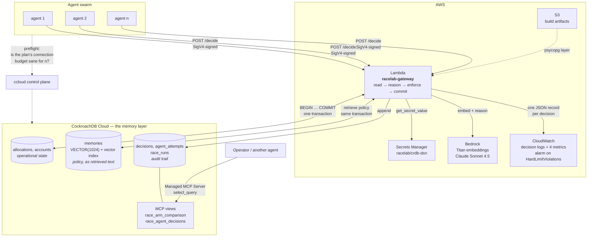

# Architecture

## The one line that matters

Both reads happen **inside the same transaction**: the operational total *and*
the policy that constrains it. The constraint is then checked after the write and
before the `COMMIT`.

That placement is the whole design. Checking outside the transaction is racy at
any isolation level; checking inside it is *still* racy under READ COMMITTED,
because another writer can commit underneath the snapshot the check read. Under
SERIALIZABLE the state you verified is the state you commit — or the commit is
refused with a `40001` and the cycle repeats.

**Serializable isolation is what lets a check performed before a commit still be
true after it.** That is what makes agent-level constraint enforcement possible,
and it is why the memory layer and the transaction boundary have to be the same
system.

## Where each rule lives

| Rule | Lives in | Recovered by | Enforceable in SQL? |
|---|---|---|---|
| `SUM(allocations) ≤ hard_limit` | a column | re-reading state | yes — a guarded `UPDATE` |
| approval ceiling | retrieved text | refreshing memory | **no** — a `WHERE` clause has no column to reference |

The second row is the contribution. A guarded `UPDATE` can only reference
columns, so a ceiling stated in a policy document, retrieved by vector search and
interpreted by a model, cannot be expressed as a predicate. It has to be enforced
at commit time by something that understands both.

## Failure paths, deliberately

| What fails | What happens |
|---|---|
| Another agent commits first | `40001` → discard the decision, re-read, **re-reason**, retry |
| Agent proposes past its own ceiling | constraint refuses → `409`, nothing written |
| Agent keeps proposing past it | refusals exhausted → `409`, still nothing written |
| Policy update never lands | the run is **voided**, not averaged in |
| Cluster unreachable | `503`, and ccloud triage says whether the cluster or the caller is at fault |
| CloudWatch unavailable | logged and swallowed — an observability outage is not a correctness outage |
| Model returns an out-of-space action | re-asked with the violation named; **never** silently replaced |
| Concurrency exceeds the plan's budget | preflight refuses to start the swarm |
