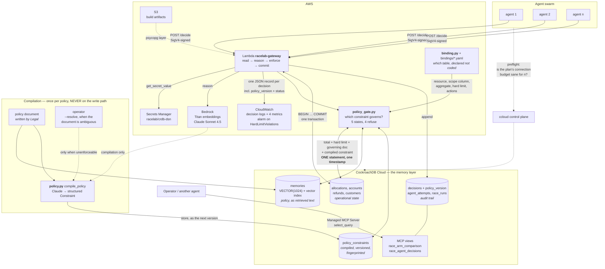

# Architecture

The `racelab` MCP server (`racelab/integrations/mcp_server.py`) sits where the
gateway does and resolves policy through **the same** `policy_gate.py`. Two write
paths holding two readings of one rule would be worse than either.

## The one line that matters

Every read happens **inside the same transaction, in one statement**: the
operational total, the hard limit, the governing policy document *and* the
compiled constraint. The constraint is then checked after the write and before
the `COMMIT`.

That placement is the whole design. Checking outside the transaction is racy at
any isolation level; checking inside it is *still* racy under READ COMMITTED,
because another writer can commit underneath the snapshot the check read. Under
SERIALIZABLE the state you verified is the state you commit — or the commit is
refused with a `40001` and the cycle repeats.

**Serializable isolation is what lets a check performed before a commit still be
true after it.** That is what makes agent-level constraint enforcement possible,
and it is why the memory layer and the transaction boundary have to be the same
system.

## Where each rule lives

| Rule | Lives in | Recovered by | Enforceable in SQL? |
|---|---|---|---|
| `SUM(allocations) ≤ hard_limit` | a column | re-reading state | yes — a guarded `UPDATE` |
| approval ceiling | retrieved text | refreshing memory | **no** — a `WHERE` clause has no column to reference |

The second row is the contribution. A guarded `UPDATE` can only reference
columns, so a ceiling stated in a policy document, retrieved by vector search and
interpreted by a model, cannot be expressed as a predicate. It has to be enforced
at commit time by something that understands both.

## Which rule is in force

`policy_gate.py` answers that, for both write paths, at the moment of the write.
The enforced constraint is the one compiled from **the document currently in
force** — not the highest version number, or a reverted policy would leave a
newer version in charge of a document it never read.

| State | Write | Meaning |
|---|---|---|
| `none` | ✅ | no policy document; only the hard limit binds |
| `compiled` | ✅ | current, enforceable, compiled from the governing document |
| `not_in_force` | ✅ | dated policy outside its window; hard limit only |
| `uncompiled` | ❌ | a policy exists and nothing was compiled from it |
| `stale` | ❌ | the document moved and nobody recompiled |
| `unenforceable` | ❌ | clauses the constraint language cannot express |
| `mismatched` | ❌ | compiled for a different resource |

`uncompiled` and `stale` are states the previous dollar-figure regex **could not
have**: it re-read the text on every request and always produced a number, so a
policy change nobody noticed still produced confident enforcement of something.
The authorizing set is an allowlist, so a state added later fails closed.

The hard limit is checked **first and in every state**. A policy that cannot
authorize is not a reason to stop enforcing the one rule the database can enforce
unaided.

## Failure paths, deliberately

| What fails | What happens |
|---|---|
| Another agent commits first | `40001` → discard the decision, re-read, **re-reason**, retry |
| Agent proposes past its own ceiling | constraint refuses → `409`, nothing written |
| Agent keeps proposing past it | refusals exhausted → `409`, still nothing written |
| **Policy document rewritten, not recompiled** | `409` `policy_status: stale` — nothing authorized against the withdrawn version |
| **Policy has never been compiled** | `409` `policy_status: uncompiled`, quoting the document that needs compiling |
| **Policy compiles to something inexpressible** | `409` `policy_status: unenforceable` — it does **not** fall back to the expressible part |
| **Constraint compiled for another table** | `409` `policy_status: mismatched` — it would evaluate cleanly and mean nothing |
| **Scope has no row in the limit table** | `409` — raises rather than defaulting; an unknown scope with an unbounded budget is the shape of every incident |
| Binding names a column that does not exist | rejected at startup against `information_schema`, not at write time |
| Deployment package misses a module | the **build** fails: the zip is imported in a clean interpreter with the layer's dependencies blocked |
| Policy update never lands | the run is **voided**, not averaged in |
| Cluster unreachable | `503`, and ccloud triage says whether the cluster or the caller is at fault |
| CloudWatch unavailable | logged and swallowed — an observability outage is not a correctness outage |
| MCP audit connection unavailable | the write proceeds, and the response says the decision went unrecorded |
| Model returns an out-of-space action | re-asked with the violation named; **never** silently replaced |
| Concurrency exceeds the plan's budget | preflight refuses to start the swarm |

---

Watch this run: **<https://racelab.fly.dev>** races real agents against the real
cluster and streams every event above as it happens.
